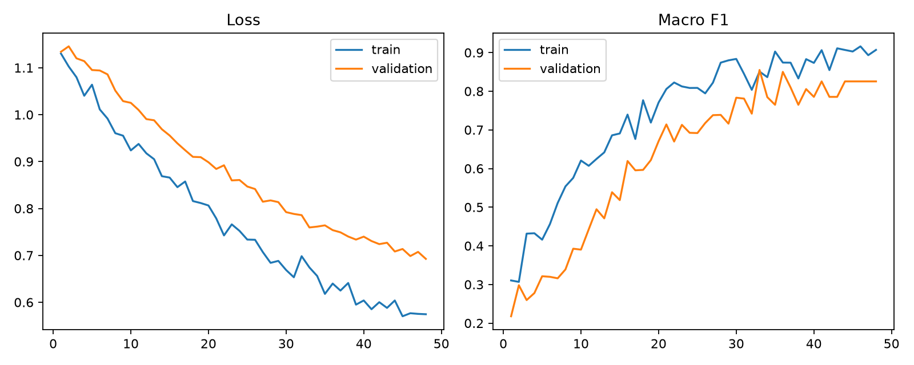

# IDSentinel

**Multi-Branch Document Presentation Attack Detection**

[Research website](https://idsentinel.vercel.app) · [Methodology](docs/IMPLEMENTATION_PLAN.md) · [Dataset audit](docs/SOURCE_CONFOUND_AUDIT.md)

IDSentinel is an independent, paper-inspired computer-vision study exploring semantic, texture, and edge representations for distinguishing bona fide identity-document captures from print and screen presentation attacks.

> Experimental research only. This is not a production identity-verification system, a liveness guarantee, or a claim of state-of-the-art performance.

## 24-hour research sprint

The project progressed from a paper and feasibility audit through provenance design, a leakage-safe reduced protocol, portrait/context extraction, three controlled model configurations, and failure-transition analysis. A proposed mixed-source composite benchmark was rejected because dataset identity could confound the class label.

## Architecture

- **M3 — Semantic:** ImageNet-pretrained ConvNeXt-Tiny at 384×384; stem and stages 0–2 frozen.
- **M4 — Semantic + Texture:** pixel-only 32×32 pooled Conv-BN-ReLU branch producing a 64-D representation.
- **M5 — Semantic + Edge:** fixed Sobel X/Y gradients followed by a lightweight learned branch producing a 32-D representation.

M4 and M5 project branch features into a shared 256-D space and use softmax-normalized learned fusion weights. Those weights are not causal feature-importance estimates.

## Results

Protocol A-Reduced contains 300 DLC-2021 samples: 100 BONA_FIDE, 100 PRINT, and 100 SCREEN. Its group-safe splits are 214 train / 42 validation / 44 test.

| Configuration | Accuracy | Macro-F1 | BONA_FIDE F1 | PRINT F1 | SCREEN F1 | Failures |
|---|---:|---:|---:|---:|---:|---:|
| M3 Semantic | 0.591 | 0.590 | 0.414 | 0.690 | 0.667 | 18 |
| M4 + Texture | **0.682** | **0.679** | 0.480 | **0.889** | 0.667 | **14** |
| M5 + Edge | 0.636 | 0.640 | 0.480 | 0.846 | 0.595 | 16 |

M4 produced the highest observed score on the frozen test split. With 44 test samples and one primary seed, this is descriptive—not evidence of statistical superiority.



## Dataset protocol

- DLC-2021 only; this is **not** the full DLC-2021 benchmark.
- Deterministic selection and group-aware splitting by `base_document_id`.
- Zero exact duplicate clusters, pHash-distance-6 near-duplicate clusters, or lineage violations crossing splits.
- RetinaFace → CLAHE + RetinaFace → Haar fallback → context expansion → 384×384 crop.
- 300/300 crops generated; one SCREEN sample required Haar fallback.

Dataset media, derived identity-document crops, prediction-level imagery, private Colab bundles, and large checkpoints are deliberately excluded from the public repository.

## Setup

```bash
python -m venv .venv
source .venv/bin/activate  # Windows: .venv\Scripts\activate
pip install -r requirements.txt
pytest -q
```

GPU training entry points:

```bash
python scripts/train_baseline.py --device cuda
python scripts/train_m4_texture.py --device cuda
python scripts/train_m5_edge.py --device cuda
```

Website:

```bash
cd web
npm install
npm run dev
```

## Repository structure

```text
src/          data, preprocessing, models, metrics
scripts/      acquisition, extraction, training, finalization
configs/      controlled experiment configuration
tests/        leakage, preprocessing, and model smoke tests
docs/         methodology, assumptions, audits, milestone reports
artifacts/    safe aggregate results and plots
web/          multi-page research website
```

## Limitations

Reduced 300-sample protocol; 44 test samples; one primary seed; incomplete full-corpus coverage; possible padding shortcut; no stochastic augmentation; unequal base-document coverage; and no production, liveness, certification, or statistical-significance evaluation. M4/M5 also changed projection/classifier architecture relative to M3, so they are not perfectly head-matched causal ablations.

## Attribution and licensing

IDSentinel is an independent implementation inspired by the architecture reviewed in [`docs/PAPER_SPEC.md`](docs/PAPER_SPEC.md). Paper-described components, implementation decisions, and observed results are kept separate. DLC-2021 source terms and retrieval records are documented under [`data/raw/source_metadata`](data/raw/source_metadata); source dataset media is not redistributed here.
